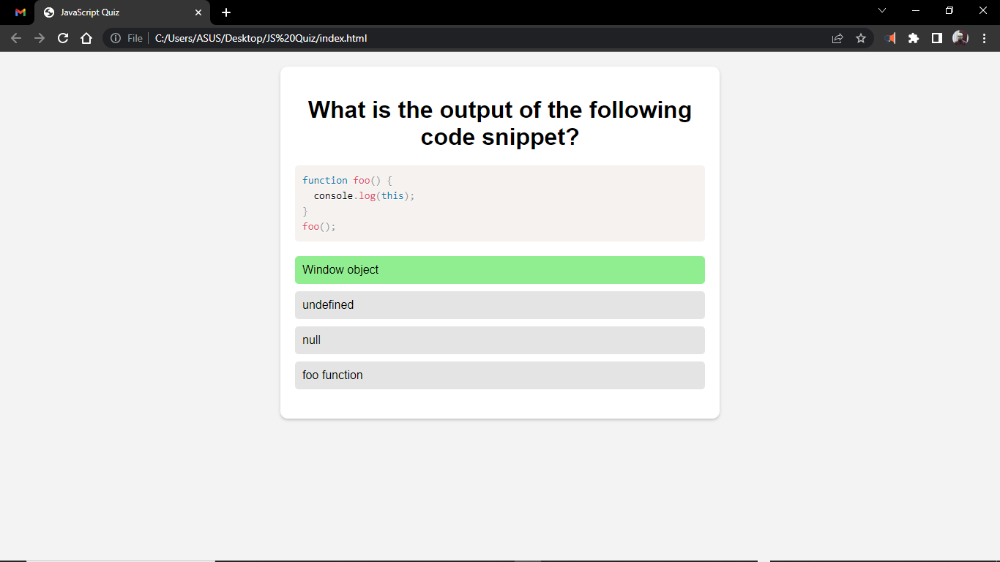
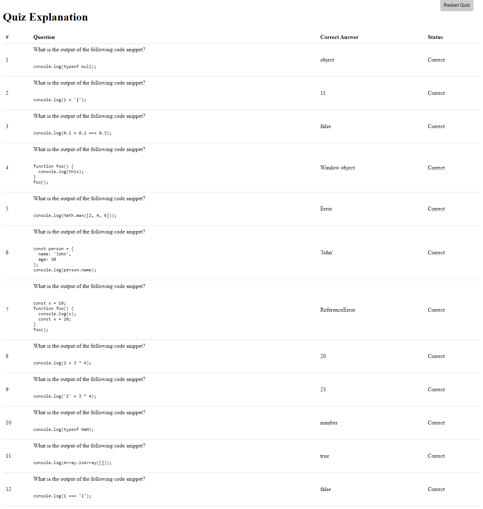

# JavaScript Quiz App

## Start Quiz here right now: [https://jucuacc.github.io/JSQuiz/](https://jucuacc.github.io/JSQuiz/)
---

The JavaScript Quiz App is a web application that presents a series of JavaScript-related questions to the user and provides instant feedback on their answers. It aims to test and improve the user's knowledge of JavaScript concepts and syntax.

The app features a user-friendly interface with multiple-choice questions and predefined options. Upon selecting an answer, the app instantly provides feedback, indicating whether the answer is correct or incorrect. The user's score is tracked throughout the quiz, allowing them to gauge their performance.

After answering all the questions, the app displays the total score achieved by the user. Additionally, it provides detailed explanations for each question and answer. This allows users to not only assess their performance but also gain a better understanding of the JavaScript concepts covered in the quiz.

.png)
.png)
.png)

## Features

- Multiple-choice questions with predefined options
- Instant feedback on correct and incorrect answers
- Score tracking
- Explanations for each question and answer

## Technologies Used

- HTML
- CSS
- JavaScript

## Usage

1. Go to the URL: [https://jucuacc.github.io/JSQuiz/](https://jucuacc.github.io/JSQuiz/)

2. Start the quiz and answer the questions by selecting one of the available options.

3. After answering all the questions, the app will display the total score and explanations for each question.

4. To restart the quiz, click the "Restart Quiz" button at the top right corner of the page.

---
